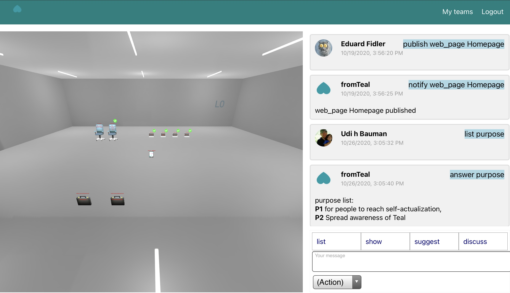

## The problem

The top need in Masslow’s pyramid of needs is the need to self-actualize - realize your calling & work on your real passion. We believe this is indeed a vital need that everyone should have a chance to fulfill.

The way people self-actualize is by creating something X that they love working on, & which they feel that the world needs, i.e., they believe other people would love X & benefit from it. The main constraint preventing people from self-actualizing is that they find themselves creating something else Y because they need to make a living & creating Y gets them the means to live. 
Why then can’t people just stop creating Y & start working on their true calling X, & find people who love it & would pay them for it, such that they can make a living from working on what they love?  
A good guess would be that people are afraid that it would take them time to create X in such a way that they can easily find people who love it & would pay for it, so they can make a living out of it. It is true that it almost always takes considerable time to turn the idea of creating X (the invention) into something that people love & benefit from (the innovation).

There’s a common way to overcome this constraint, which is to try convince people who invest money in new entrepreneurs, allowing them to work on creating X until they can easily find people who love X & would pay them for it. That seems like a great solution, however, there’s an inherent flaw in it, which is the misalignment of goals between the people who want to self-actualize & the investors giving them money. While the entrepreneurs are driven by a calling to change something in the world - their purpose is to create X so that people would love it & benefit from it - the investors, aka venture capitalists, are driven by just the goal of maximizing money returns for themselves & the people who gave them money. When people take an investment from venture capitalists, they normally give up significant control of their venture to the investors who don’t care much about their calling or purpose, but are rather only driven by financial interests. In many cases, this leads to the entrepreneurs being kicked out of their own venture at some point, or be forced not to work on their real purpose.

## The hypothesis

Our hypothesis is that you don’t really need to take money from investors to start creating what you want to create & find the people who would love it & pay for it. There’s an alternative to taking investors money in order to hire people who will create X with you. We base this hypothesis on a type of event that happens all over the world, in a format called Hackathon. In these events, self-organizing teams build a product in few days, that’s ready for initial pilot & iteration with customers, all without any funding from investors. Anyone who ever been to such event would testify that there’s at least an order of magnitude difference in how much Hackathon teams are more productive, creative & effective than teams in regular organizations. What if a self-organizing team continues working like that for longer - if that's what they produce in couple days, imagine what they can produce in a month, year or a decade?

How can one explain this? There could be many explanations, but we believe the strongest one is a special characteristic of Hackathon teams that no one pays attention to: they don’t have bosses or hierarchy. These self-organizing teams may have leaders, but they don’t have an hierarchy of power, where some people have the power to make decisions & some don’t. Without bosses telling team members what to do, everyone have the full freedom to exercise their creativity & be fully engaged as owners. 

So basically our hypothesis is that if someone wants to self-actualize, but require time & resources to get to the point where they can make a living out of working on their calling or purpose, they can leverage the concept proved in Hackathon - create a self-organized & self-managed team, with others that share the same calling or purpose, so that they can all self-actualize together, without the need for investors.

With the advent of digital technology, there are now free, accessible & effective services for anyone to search & acquire knowledge, hear what anyone in the world says & communicate with them, make transactions with anyone around the world. It's about time there would be also a free, accessible & effective service for people to start or discover self-organizing team working on the thing they want to change in the world, their passion or purpose, so they can reach self-actualization.  

## The constraints

If our hypothesis is correct, why aren’t hackathons enough then as an alternative to the conventional investors model? Why aren’t we seeing many companies started from hackathon events?

We think there are multiple reasons or constraints, that stand between Hackathon teams & successful businesses:
 
1. Although Hackathon teams work miraculously during the hackathon, outside of it they don’t maintain the flat organizational structure that leads to such extreme productivity, creativity & effectiveness. This constraint is mostly due to people's inertia of following the common conventions, without being aware that there are other successful ways to run organizations.

2. It's a challenge to find more people passionate about the same purpose in order to grow the self-organzing team.

3. Successful business require also knowledge, connections & guidance, which is what good investors provide beyond money, & is something normally not available for Hackathon teams. This includes knowledge & guidance leveraging the experience of other companies, connections & community to learn & collaborate with, demand for progress & accountability on milestones.

4. A self-organizing Hackathon team needs to form some equity model when forming a business, which could be a challenge & in many cases cause tensions.

5. Building a great product isn’t enough, & you also need to find the people who would love it & pay for it, which isn’t something you normally get in Hackathon events.

## The project

We formed fromTeal to help people reach self-actualization - remove the constraints preventing them from making a living from working on what they love. We do this by building an eco-system that removes these constraints by:
* Enabling & teaching people how to form self-organizing, self-managed teams around a shared passion & purpose, just like in Hackathons, but not just for a limited time
* Helping people find others who share the same passion or purpose
* A peer-coaching mechanism for providing knowledge & guidance, connections & community, progress & milestones accountability, similar to what good VC’s provide
* Forming a fair equity model for teams
* Creating the marketplace to help teams easily find the people who would love & pay for what they create

To teach teams how to self-organize without bosses & a hierarchy of power, we educate them on the principles & best-practices of self-managed teams, which were proven to work in some highly successful companies, such as Patagonia, Zappos, Gore, Valve, Morning Star & many others. These principles were described in books such as “Reinventing Organizations”, “Freedom Inc”, “The Human Side of Enterprise”, which show how a self-organizing team such as those in a hackathon can actually form a highly successful business. The teams in these companies are purpose driven: they are truly driven by a calling, trying to make a change in the world. They are also self-managed teams: the companies are split to teams that don’t have any hierarchy between & within them. Each person has the power to make decisions, as long as they ask for advice from others. There’s no need to ask for permission from the management. Everyone are free to exercise their creativity & everyone truly care for the success of the company & they customers.

fromTeal provides the added value similar to that provided by VC’s in the form of peer-coaching - teams provide coaching sessions to other teams, to share knowledge, provide guidance, form a community & help keep each others accountable for progress & milestones. 

We also facilitate an equity model, so that teams can fairly share the ownership of the venture they’re creating.
